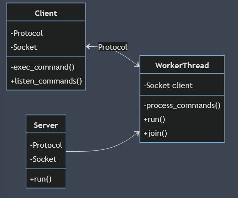
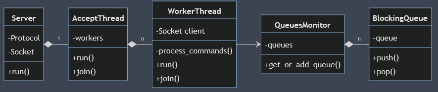
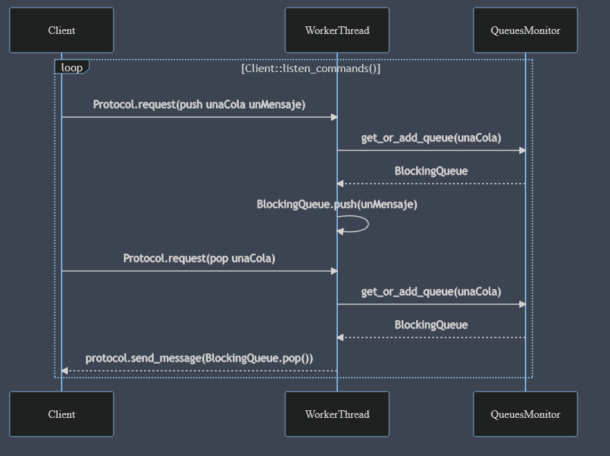

# TP3
## Taller de Programación FIUBA 2021 2C
## Manuel Reberendo 100930
<br>
<br>

# Introducción
El TP consiste en diseñar un *Message Oriented Middleware* (MOM) constituido por un Servidor que posee un repositorio de colas de mensajes (Cada una identificada por un nombre) y que puede atender a multiples clientes, que podrán crear colas, agregar mensajes a ellas, y consumirlos.

# Clases
Para la resolución del trabajo se utilizan diversas clases, cuyas principales caracteristicas e interacciones veremos con detalle a continuación:
## Clases compartidas
Hay dos clases que son utilizadas tanto por el cliente como por el servidor. Estas son las clases `Socket` y `Protocolo`:
### Socket
Se trata de un *wrapper* de un socket de c, pero en c++ y RAII.  
Se distingue principalmetne por lanzar un error cuando hay una falla en la comunicación provocada por el cierre de alguno de los dos sockets involucrados.
### Protocolo
Esta clase es utilizada por el cliente y servidor para enviarse mensajes entre si abstrayendo el protocolo "a nivel bytes" utilizado, que es el que por consigna debemos implementar.  
Todos sus métodos reciben una referencia a un `Socket`, que será de origen o destino dependiendo el caso.

## Clases del Cliente
### Client

El cliente solo hace uso de la clase `Client`, que implementa la lógica y el bucle principal del cliente, y su alcance es relativamente simple:

- Recibir comandos por entrada estandar
- "Ejecutar" esos comandos enviandolos al servidor
- Mostrar en pantalla el mensaje de respuestad el comando "pop"
- Salir ordenadamente si hubo algún error

Entre sus funciones más relevantes se encuentran:

```cpp
void Client::listen_commands(){
    std::string command;    
    while (this->is_running && std::getline(std::cin,command)){
        // Split del comando en un vector
        std::vector<std::string> command_vector;
        this->split_command(command_vector,command);
        //Se ejecuta el comando
        this->exec_command(command_vector);
    }
}
```
Que es la encargada de sostener el bucle principal, en el que se recibe por entrada estandar un comando, se parsea y se ejecuta.  

```cpp
void Client::exec_command(const std::vector<std::string>& vector){
    const std::string& command = vector[0];
    if (command == "exit"){
        this->is_running = false;        
    } else if (command == "push" && vector.size() > 2){
        this->protocol.request(this->socket,command,vector[1],vector[2]);
    } else if ((command == "pop" || command == "define") && vector.size() > 1){
        this->protocol.request(this->socket,command,vector[1]);
        if (command == "pop"){
            std::cout << this->protocol.recv_message(this->socket) << std::endl;
        }
    } else { throw "Invalid Command";}
}
```
Que es utilizada por `listen_commands()` y se encarga de enviar el comando ya parseado hacia el servidor.  
Tal como se había comentado, se ve cómo el cliente utiliza una instancia de `Protocol` para comunicarse con el socket del servidor, simplemente indicando el comando y el mensaje a enviar, abstrayendo así la lógica del protocolo subyacente.  
A continuación, un diagrama (simplificado) de esta clase y su interacción con el servidor (cuyas clases veremos más adelante):  


## Clases del Servidor
El caso del servidor es un poco más complejo. A modo de intruducción se muestra el siguiente diagrama de clases, que intenta resumir la estructura de sus clases constituyentes:  

### Server
La clase principal, punto de entrada y encargada de correr el bucle `main_loop()` en la función `main` del programa.  
Su principal función es la de lanzar el hilo aceptador y "escuchar" por entrada estandar, ya que si se recibe la letra q, debe finalizar su ejecución.  
Aquí su función más relevante `main_loop()`:
```cpp
void Server::main_loop(){
    AcceptThread accept_thread(this->socket,
                            this->queues,
                            this->protocol);
    std::string input = "";
    while (input != "q"){
        std::getline(std::cin,input);
    }    
    this->socket.force_stop();
    accept_thread.join();
}
```
Nótese que para finalizar la ejecución se fuerza el cierre del socket aceptador, y de esta manera dejan de aceptarse conexiones de nuevos clientes.   
### AcceptThread
Representa al hilo "aceptador". Se encarga de aceptar nuevos clientes y asignarles a cada uno un nuevo hilo Worker, además de manejar los Workers existentes y liberarlos si ya no se encuentran activos.  
Al crearse lanza un hilo cuya función de entrada es la siguiente:
```cpp
void AcceptThread::run(){          
    while (this->is_running){
        try{
            Socket client = this->socket.accept();                    
            this->workers.push_back(new WorkerThread(std::move(client),
                                                this->queues,
                                                this->protocol));
        }
        catch(...){
            this->is_running = false;
        }        
        this->remove_dead_workers();
    }
    this->remove_workers();
}
```
Que simplemente se encarga de esperar (mientras que la variable `is_running` sea verdadera) nuevas conexiones de clientes y, cuando llegan, agregar un hilo worker (con la clase `WorkerThread` que ya veremos) asociado a este nuevo cliente, y luego remover workers que puedan haber "muerto" en este intervalo.  
Como vimos, `Server` fuerza el cierre del socket aceptador al recibir la señal de finalización por consola, que lo que hace es que `socket.accept()` lance un error que será *"catcheado"* en esta función y romperá el ciclo `while`. Por último, se deben remover todos los workers que se encontraran activos al momentod e la finalización.

### BlockingQueue
Se trata de una cola bloqueante y *thread-safe* de `std::string`, y es utilizada para la implementación de una cola de mensajes.  
Debe ser *thread-safe* ya que es posible que múltiples hilos intenten acceder a ella, ya sea para agregar un mensaje a la cola como para desencolarlo de ésta.  
Luego, el hecho de que sea bloqueante garantiza que si un cliente intenta hacer `pop` de una cola que aún no tiene mensajes (está vacía) este esperará hasta que otro cliente haga un `push` sobre la misma, en vez de no retornar nada, o de lanzar un error.  
Dentro de sus funciones críticas, se encuentran `push` y `pop`, respectivamente:
```cpp
void BlockingQueue::push(const std::string &item){
    std::unique_lock<std::mutex> unique_lock(this->mutex);    
    this->queue.push(item);
    this->condition_variable.notify_all();    
} 
std::string BlockingQueue::pop(){
    std::unique_lock<std::mutex> unique_lock(this->mutex);
    while (this->queue.empty()){        
        if (!this->open){
            throw "BlockingQueue Closed";
        }
        this->condition_variable.wait(unique_lock);
    }
    std::string item = this->queue.front();
    this->queue.pop();
        
    return item;
} 
```
En ambas se destaca el uso de el `mutex` para proteger las *critical sections*, haciendolas *thread-safe*, y el uso de la *condition variable* para hacerla bloqueante: Se espera en el `pop()` cuando no hay mensajes, y se notifica en el `push()` para desbloquearlo.

### QueuesMonitor
Es un almacenamiento protegido (*thread-safe*) de las colas de mensajes anteriormente vistas. Esto es necesario ya que, nuevamente, multiples hilos pueden querer acceder al mismo recurso, provocando una *race condition*.  
En la practica, esto no es mas que un `std::unordered_map` cuyas claves son `std::string` con el nombre de una cola, y su valor, la `BlockingQueue` correspondiente, y cuyo punto de acceso , la función `get_or_add_queue()` está protegida con el uso de un `mutex`:
```cpp
BlockingQueue& QueuesMonitor::get_or_add_queue(const std::string& queue_name){
    std::unique_lock<std::mutex> unique_lock(this->mutex);
    return this->queues[queue_name];
}
```

### WorkerThread

Representa un hilo *"Worker"*, que se encarga de recibir y procesar los requests de un cliente asociado.  
Como vimos, estos workers son generados por el hilo aceptador al momento de aceptar un nuevo cliente, y son los "dueños" del socket asociado, que utilizarán para esta comunicación.  
En su creación genera un hilo cuyo punto de entrada es la función `run()`, que consiste en un simple bucle en el que, mientras el atributo interno `is_running` sea verdadero, excuchará y procesará los comandos que reciba del socket cliente.  
Esta recepción y proceso de comandos se implementa en la función `process_commands()` que sería el análogo a la función `exec_command()` que vimos en la clase `client`:
```cpp
void WorkerThread::process_commands(){
    char command_id;
    std::string queue_name;
    std::string message;    
    std::tie(command_id, 
            queue_name, 
            message) = this->protocol.recv_command(this->socket);
    if (command_id == 'd'){                
        this->queues.get_or_add_queue(queue_name);
    } else if (command_id == 'u'){
        this->queues.get_or_add_queue(queue_name).push(message);
    } else if (command_id == 'o'){
        this->protocol.send_message(this->socket,
                            this->queues.get_or_add_queue(queue_name).pop());
    }
}
```  
Como se dijo, se espera un comando del socket cliente, y a partir de este agrega una cola, un mensaje en una cola o devuelve un mensaje desencolado de una cola, según corresponda en cada caso, y, nuevamente, utilizando como interfáz una instancia de la clase `Protocol`.  
Al lanzarse un error en esta función, la función principal `run()` seteará la variable `is_running` como falsa, terminando el bucle y haciendo que la próxima vez que el hilo aceptador pregunte si el worker está vivo, lo remueva.

### Interacción típica cliente-servidor
Para finalizar, se muestra un diagrama que ilustra, de forma simplificada, una posible interacción entre un cliente y el servidor, cuando un cliente ejecuta el comando `push` y luego `pop`:



